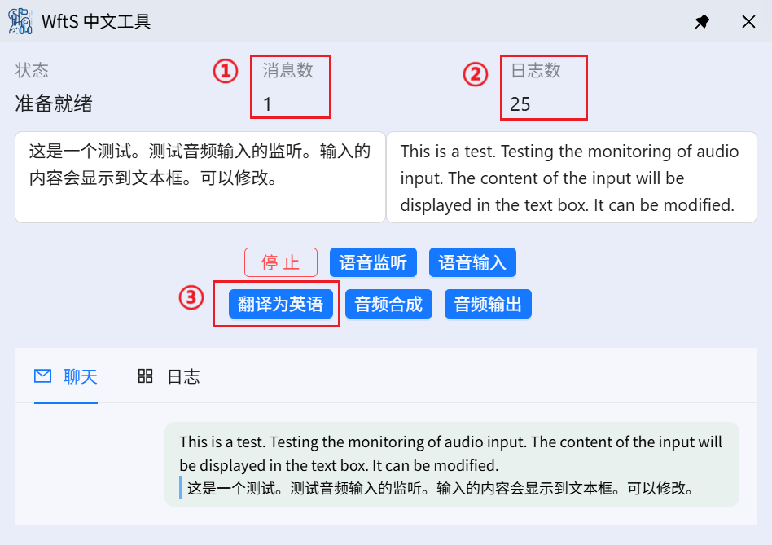

<div align="center" >
    
    <h1 align="center">wfts-chinese-tool</h1>
    <p>wfts-chinese-tool 为中文玩家准备的一个工具软件。用户可以通过该软件获取对话的中文翻译，用户还可以将中文语音转换为英语并输入到游戏中。</p>
    <p>
      <a href="https://github.com/HiMeditator/wfts-chinese-tool/releases"></a>
      <a href="https://github.com/HiMeditator/wfts-chinese-tool/issues"></a>
      
      
    </p>
</div>


## ✨ 软件特性

- 获取对话和翻译
- 中文输入英语翻译
- 英语音频合成
- 合成音频播放与注入

## 📥 软件下载

> [更新日志](./docs/CHANGELOG.md)

[GitHub Releases](https://github.com/HiMeditator/wfts-chinese-tool/releases)

## ⚙️ 软件功能



软件共有六个按钮代表不同的功能。

- 第一个按钮：启动和关闭服务。
- 第二个按钮：监听系统音频输出，并翻译为中文并将内容显示到聊天区。
- 第三个按钮：用户英语输入，监听用户的语音输入（建议用中文）并翻译成英语，显示到两个输入框中。输入框中的内容可以修改。
- 第四个按钮：调用大语言模型将输入框左边的内容翻译成英语，这个翻译会比语音模型自带的翻译更准确。
- 第五个按钮：将输入框右边的英语内容合成为音频。
- 第六个按钮：将合成的音频同时进行播放和注入到 [VB Cable](https://vb-audio.com/Cable/) 虚拟音频设备中。

**软件的功能比较灵活，可以用于游戏之外。**

## 📖 基本使用

[介绍视频](https://www.bilibili.com/video/BV1kVbJzjEv7)

该项目仅支持 Windows 系统。

本项目使用了阿里云的云端模型（语音识别模型、语音合成模型）。要使用这些模型首先需要获取阿里云百炼平台的 API KEY，然后将 API KEY 添加到软件设置中或者配置到环境变量中。相关教程：

- [获取 API KEY](https://help.aliyun.com/zh/model-studio/get-api-key)
- [将 API Key 配置到环境变量](https://help.aliyun.com/zh/model-studio/configure-api-key-through-environment-variables)

**如果没有将阿里云的 API KEY 配置到环境变量，该项目将无法正常工作！**

除此之外，还需要安装 [VB Cable](https://vb-audio.com/Cable/) 虚拟音频设备软件。软件将使用该音频设备将合成的英语音频注入到游戏的虚拟麦克风中。

完成上述操作后建议重启计算机以使得操作生效。

之后每次启动游戏时，打开系统的“音量合成器”选项，首先设置游戏的输入设备为默认，待游戏启动后再改为 CABLE Output。


## 📊 模型清单

该软件可能用到的模型列表如下

| 模型                | 类型           | 链接                                                         | 备注                                           |
| ------------------- | -------------- | ------------------------------------------------------------ | ---------------------------------------------- |
| `gummy-realtime-v1` | 阿里云模型     | [Gummy](https://bailian.console.aliyun.com/?tab=model#/model-market/detail/gummy-realtime-v1) | 实时语音识别模型                               |
| `cosyvoice-v2`      | 阿里云模型     | [Cosyvoice](https://bailian.console.aliyun.com/?tab=model#/model-market/detail/cosyvoice-v2) | 语音合成模型                                   |
| `qwen-max`          | 阿里云模型     | [Qwen-Max](https://bailian.console.aliyun.com/?tab=model#/model-market/detail/qwen-max?modelGroup=qwen-max) | 通用大语言模型，用于将识别的中文内容翻译成英语 |
| 自定义              | Ollama本地模型 | [Ollama](https://ollama.com/)                                | 本地大语言模型，用于将识别的中文内容翻译成英语 |

## 🚀 运行项目

克隆仓库：

```bash
# HTTPS
git clone https://github.com/HiMeditator/wfts-chinese-tool.git
# SSH
git clone git@github.com:HiMeditator/wfts-chinese-tool.git
```

安装依赖：

```bash
npm install
```

构建 python 运行环境：

```bash
cd chat
# 在 /chat 目录
python -m venv .venv
.venv/Scripts/activate
pip install -r requirements.txt
```

打包 Python 程序：

```bash
# 在 /chat 目录，激活 Python 虚拟环境运行
pyinstaller main.spec
```

运行项目：

```bash
npm run dev
```

构建项目：

```bash
npm run build:win
```
