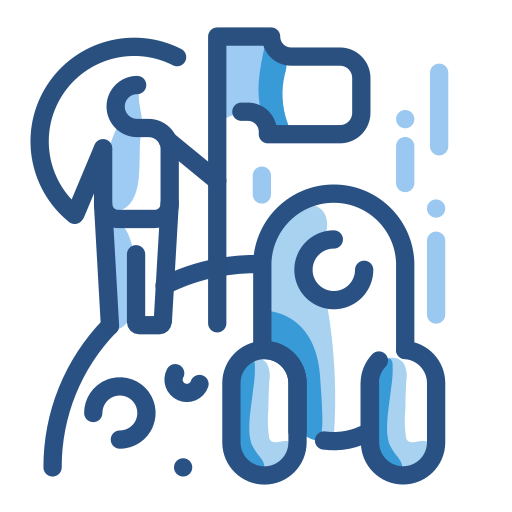
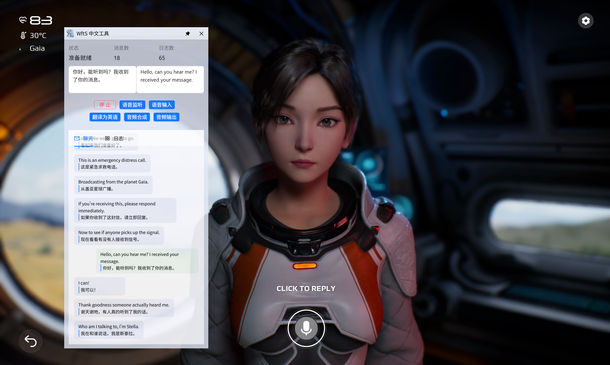
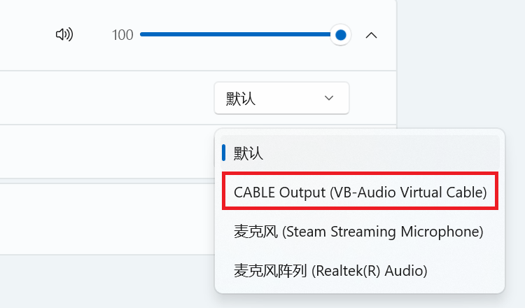

<div align="center">
    
    <h1 align="center">wfts-ai-chat</h1>
    <p>wfts-ai-chat is a project that attempts to play the AI game "Whispers from the Stars" using cloud models.</p>
    <p>
        | <a href="./README.md">简体中文</a>
        | <b>English</b> |
    </p>
    <p><i>The project has been initially developed, and the release version will be available later...</i></p>
</div>



## 📖 Basic Usage

This project only supports Windows systems. Currently, there is no release version available; users need to clone the repository and set up the development environment themselves to run the project. Alternatively, they can wait for the release version to be published later.

This project uses multiple Alibaba Cloud models (speech recognition model, large language model, speech synthesis model). To use these models, you first need to obtain an API KEY from Alibaba Cloud's Model Studio platform, then add the API KEY to the software settings or configure it as an environment variable. Related tutorials:

> The international version of Alibaba Cloud services does not fully provide the models used in this project. Therefore, non-Chinese users cannot directly use the project at present. If you are a developer, you may consider changing the models used in the project (audio-to-text model, chat model, speech synthesis model).

- [Obtaining API KEY (Chinese)](https://help.aliyun.com/zh/model-studio/get-api-key)
- [Configuring API Key through Environment Variables (Chinese)](https://help.aliyun.com/zh/model-studio/configure-api-key-through-environment-variables)

The project will not function without an API KEY.

Additionally, before running the project, you need to install the [VB-Cable](https://vb-audio.com/Cable/) virtual audio device software, which is used to inject the synthesized response audio into the game's virtual microphone.

Each time you start the game, open the system's "Volume Mixer" option, first set the game's input device to default, and then change it to CABLE Output after the game has started.



## 🚀 Development Environment Setup

Clone the repository:

```bash
# HTTPS
git clone https://github.com/HiMeditator/wfts-ai-chat.git
# SSH
git clone git@github.com:HiMeditator/wfts-ai-chat.git
```

Install dependencies:

```bash
npm install
```

Build Python runtime environment:

```bash
cd chat
# in ./chat folder
python -m venv .venv
.venv/Scripts/activate
pip install -r requirements.txt
```

Run the project:

```bash
npm run dev
```

Building the project is currently not supported.
